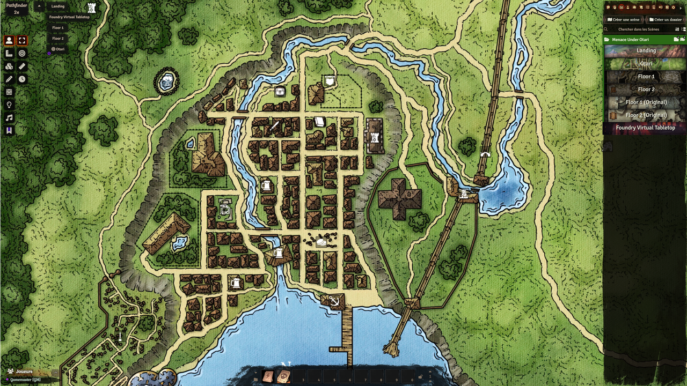
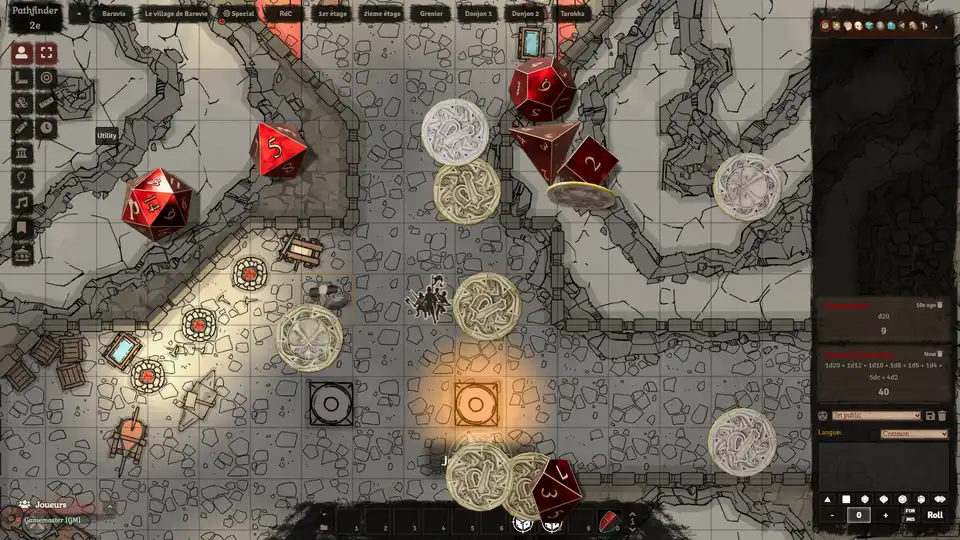
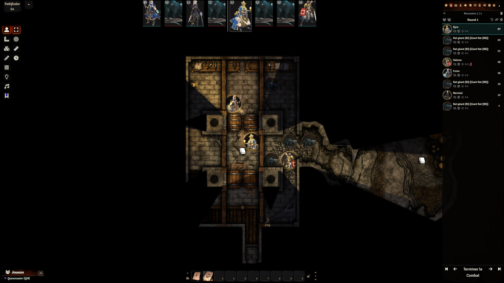
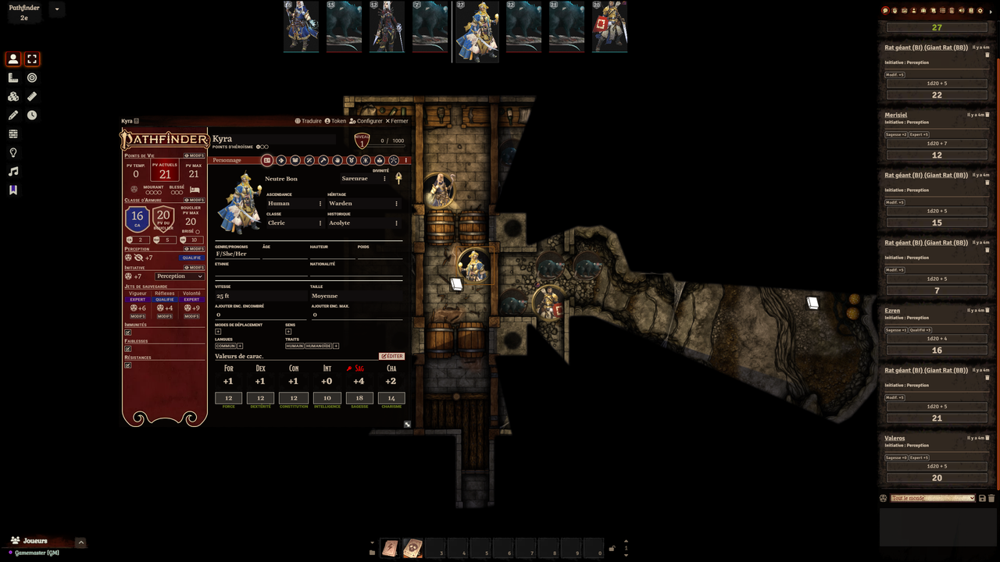

# FoundryVTT - Pathfinder-ui v3
A dodgy fork of RPG Styled Ui by Xbozon for Pathfinder 2e.

## Installation

To install, follow these instructions:

1.  Inside Foundry, select the Game Modules tab in the Configuration and Setup menu.
2.  Click the Install Module button and enter the following URL: 
https://gitlab.com/sasmira/pathfinder-ui/-/raw/master/module/module.json
3.  Click Install and wait for installation to complete.

## Pathfinder Ui v3, it's :

1.  __**Theme based on RPG Styled UI Foundry VTT by [Xbozon](https://github.com/Xbozon/rpg-styled-ui)**__

2.  __**Dicefinder**__,  dice for Pathfinder ! require [Dice-So-Nice](https://gitlab.com/riccisi/foundryvtt-dice-so-nice)

3.  __**Carousel Combat Tracker Compatibility**__  ! require [Carousel Combat Tracker](https://github.com/theripper93/combat-tracker-dock)

4.  __**Dark Mode Player Sheet Option**__

5.  __**Translation**__, French and English !

## Version & Compatibility

- Compatibility Foundry VTT v11.
