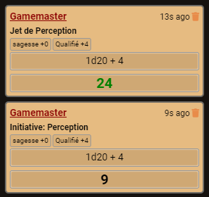
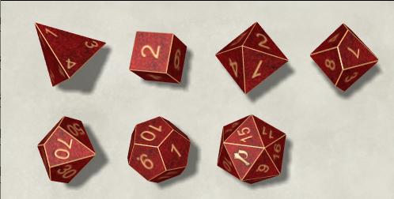

# FoundryVTT - Pathfinder-ui
A dodgy fork of Fantasy Ui by Iotech with a Pathfinder 2e theme.

## Installation

To install, follow these instructions:

1.  Inside Foundry, select the Game Modules tab in the Configuration and Setup menu.
2.  Click the Install Module button and enter the following URL: https://gitlab.com/sasmira/pathfinder-ui/-/raw/master/module/module.json
3.  Click Install and wait for installation to complete.

## Pathfinder Ui, it's :

1.  __**New icons for Pathfinder**__
2.  __**Chat colors**__
3.  __**Dicefinder**__, new dice for Pathfinder ! require [Dice-So-Nice](https://gitlab.com/riccisi/foundryvtt-dice-so-nice)
4.  __**Translation**__, French and English !

## Version & Compatibility

- Tested on 0.6.4 version.
