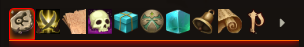

# Pathfinder-ui
A dodgy fork of Fantasy Ui by Iotech with a Pathfinder 2e theme.

**Pathfinder Ui, it's :**
- __**New icons for Pathfinder**__
- __**Chat colors**__
- __**Dicefinder**__, new dice for Pathfinder ! require [Dice-So-Nice](https://gitlab.com/riccisi/foundryvtt-dice-so-nice)
- __**Translation**__, French and English !

